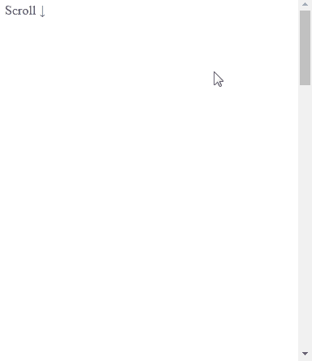

# Back to top

Back to top jQuery Component base on http://jsfiddle.net/gilbitron/Lt2wH/



## Install

## Usage

import `css/js` files

```html
<link rel="stylesheet" href="./dist/backtotop.css">
<script src="./dist/backtotop.js"></script>
```

then invoke

```js
$.backtotop(element)
```

## API

- `$.backtotop(element)`
  - element element or jQuery element
